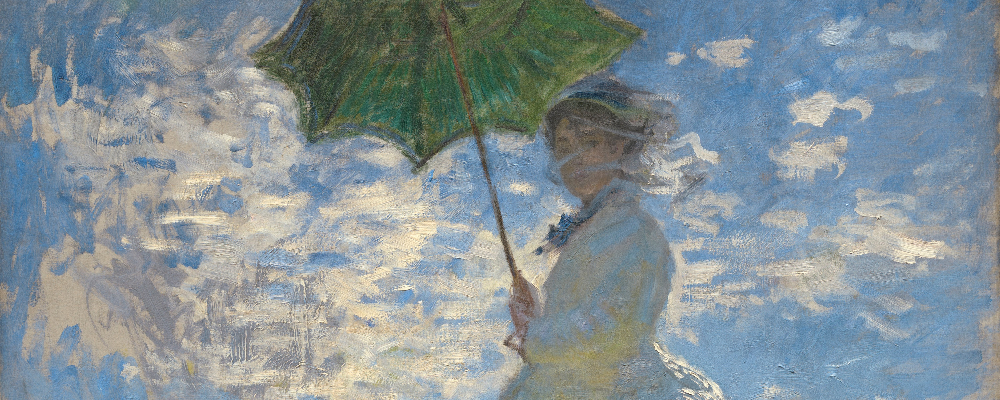
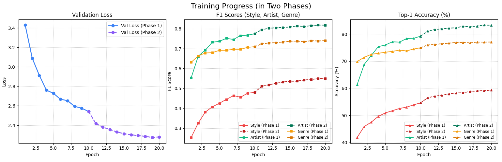
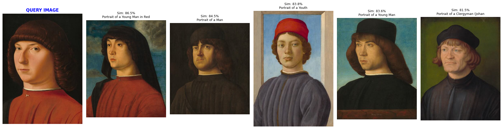
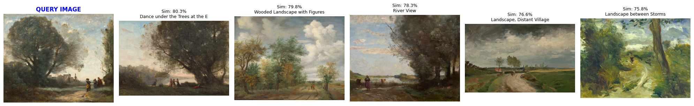
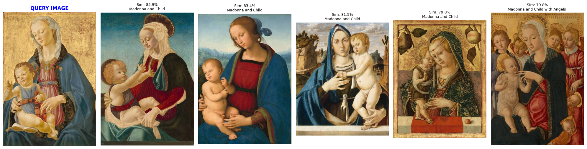

# ArtExtract: Task 1 (Multi-Task Classification) & Task 2 (Painting Similarity)


The detailed approach for each task 1 and task 2 is explained inside the corresponding notebooks.

Find notebooks at:
- Task 1 : 
    - notebook: [click here](notebooks/task1-CRNN-WikiArt-Classification.ipynb) 
    - pdf: [click here](pdf/task1-CRNN-WikiArt-Classification.pdf)
- Task 2 : 
    - notebook: [click here](notebooks/task2-Painting-Similarity.ipynb) 
    - pdf: [click here](pdf/task2-Painting-Similarity.pdf)

Run following to install dependencies:
```bash
pip install -r requirements.txt
```
### Task 1:
---
As instructed in Task 1 to use a Convolutional-Recurrent Architecture, I have used ResNet50 as a feature extractor (after removing the final avg pool layer and fully connected layer) and then made BiLSTM learn those extracted features, the final extracted hidden state from BiLSTM is then used to do the classification for each task by using seperate Linear layers. Then I use Two Phase Training where I freeze the CNN layers of ResNet50 and let the BiLSTM + Head layers train itself in the first phase and, in the second phase I Un-freeze the CNN layers and fine-tune the whole network. (please refer [notebook](notebooks/task1-CRNN-WikiArt-Classification.ipynb) for explanation)

To reproduce the results follow the below instructions:
1. Download the WikiArt Dataset from [official repo](https://github.com/cs-chan/ArtGAN/blob/master/WikiArt%20Dataset/README.md) and extract the downloaded zip file to `data/wikiart` (it must contain all the images)
2. The Image filenames in the wikiart dataset has special character like `'`, which cause data loading errors. Hence, It needs to be renamed, which is automatically handled by the `task1_main.py` script.    
3. The CSV file is already included with this repo so you do not need to download CSV. (The actual CSV had `'` in between filenames that cause error while loading file path in the linux so I used a simple script to clean the CSV to rename the filepath to not include `'` in the name)
4. Run the following:
```bash
python task1_main.py
```
### Task 2:
---
In Task 2, we are required to find similar paintings based on poses, face, and other several hidden details. Though we could use a typical CNN based architectures like VGG Net, ResNet as done by Soyung in her [repo](https://github.com/PSY222/Painting_similarity_AI) I would like to avoid that and instead use a Vision Transformer (ViT). When dealing with fine art datasets like the National Gallery of Art (NGA) Open Data, standard Convolutional Neural Networks (CNNs) encounter critical limitations that Vision Transformers are naturally equipped to solve. Specifically, CNNs suffer from an inherent texture bias, optimizing for local stylistic artifacts like brushstrokes or medium rather than the actual semantic content. A ViT, by contrast, processes the image globally via patch-based self-attention, naturally prioritizing structural geometry and spatial relationships. This stronger shape bias allows us to map paintings into a latent space where similarity metrics actually correlate with shared poses and facial structures across completely different artistic domains, while the lightweight architecture ensures our vector retrieval remains computationally viable. 

Here are the steps to reproduce the results:

1. Download only paintings from NGA server. Run the following to get the data:
```bash
python utils/get_nga_paintings.py \
    --objects_csv data/NGA/objects.csv \
    --images_csv data/NGA/published_images.csv \
    --output_dir data/NGA/images \
    --sample_size 5000 \
    --max_threads 30
```

2. Run the following:
```bash
python task2_main.py
``` 


### Results:
---
#### Task 1: Multi-Task Classification 
(please refer [notebook](notebooks/task1-CRNN-WikiArt-Classification.ipynb) for explanation of results)



| Architecture | Style (Top-1 / F1) | Artist (Top-1 / F1) | Genre (Top-1 / F1) | Global F1 |
| :--- | :---: | :---: | :---: | :---: |
| ResNet18 (10e Frozen) | 46.48% / 0.3851 | 71.03% / 0.6872 | 71.08% / 0.6575 | 0.5766 |
| ResNet50 (10e Frozen) | 54.65% / 0.4799 | 79.21% / 0.7746 | 74.96% / 0.7096 | 0.6547 |
|🔥**ResNet50 (10e Frozen + 10e FT)** | **59.33%** / **0.5502** | **83.25%** / **0.8179** | **77.06%** / **0.7401** | **0.7027** |

*\*Note: The RNN and Multi-Head configurations remained constant across all experiments. (10e = 10 epochs, FT = Fine-Tuned).*

#### Task 2: Painting Similarity
(please refer [notebook](notebooks/task2-Painting-Similarity.ipynb) for explanation of results)





